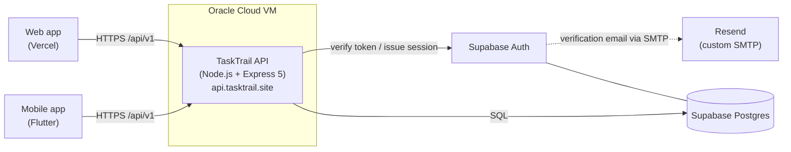

<div align="center">

# TaskTrail

**Team-based work assignment and execution platform for managers and employees.**

[tasktrail.site](https://tasktrail.site) · [API health](https://api.tasktrail.site/api/v1/health) · [Mobile client]((https://github.com/Harry830/tasktrail-mobile))

</div>

---

TaskTrail solves a common team-ops problem: work gets scattered across chat, memory, sticky notes, and spreadsheets, so managers lose visibility and employees lose clarity. TaskTrail brings that work into one place so teams can assign tasks, track progress, manage memberships, and keep recurring work from slipping.

It ships as a web app, a mobile app, and a single shared REST API, all running on the same Postgres database.

This monorepo contains the backend API and the web frontend. The mobile client is a separate Flutter repository that consumes the same API.

## Contents

- [What it is](#what-it-is)
- [Features](#features)
- [Architecture](#architecture)
- [Tech stack](#tech-stack)
- [Deployment](#deployment)
- [Repository structure](#repository-structure)
- [Local development](#local-development)
- [Demo accounts](#demo-accounts)
- [Documentation](#documentation)
- [Notable engineering decisions](#notable-engineering-decisions)
- [Mobile client](#mobile-client)

## What it is

Two roles share one product spine.

**Managers** get a light Dashboard as an attention surface, a Worker Tracker drill-down, a Tasks surface for create/assign/edit, Teams for roster and join-access control, and a Profile. Recurring task rules let them schedule repeating work that generates real task instances on a cadence.

**Employees** get My Tasks as the default work surface, a Calendar for due-date visibility across their teams, Teams for membership and leave flow, a Join Team onboarding for new members, and a Profile.

The backend enforces role-aware access control end-to-end, so the same API safely powers both the web client and the mobile client.

## Features

- Role-aware flows for managers and employees, gated by backend RBAC
- Team join access via short codes and invite links managers can regenerate
- Self-serve employee join, leave, and rejoin with durable membership history
- Task CRUD, assignment, reassignment, progress updates, and completion
- Per-task activity history captured in `task_updates`
- Recurring task rules that generate real task instances on a schedule
- Manager Worker Tracker drill-down and attention dashboard
- Employee Calendar with due-date visibility across active teams
- Supabase Auth signup with Resend-backed verification email and custom branded templates
- Self-profile editing for safe personal fields
- Shared static frontend on Vercel, backend container on Oracle Cloud, one API for web and mobile

## Architecture



Request flow inside the API:

```text
route → controller → validator (Zod) → service → repository → Supabase Postgres
                                                            ↘ response envelope
```

Keeping HTTP concerns in controllers, business logic in services, and SQL in repositories lets the same backend serve web and mobile without leaking client-specific behavior into core logic.

## Tech stack

| Layer | Choice |
| --- | --- |
| Backend runtime | Node.js 22 LTS |
| Web framework | Express 5 |
| Validation | Zod |
| Database | Supabase Postgres |
| Auth | Supabase Auth (verified by backend) |
| Email | Supabase Auth custom SMTP via Resend |
| Tests | Vitest + Supertest |
| Web frontend | Vanilla HTML / CSS / JS, hash router, no build step |
| Mobile | Flutter (separate repo) |
| Web hosting | Vercel |
| API hosting | Oracle Cloud (Docker on a VM) |
| CI/CD | GitHub Actions → GHCR → SSH deploy to OCI |

## Deployment

The backend is a Docker image built from [`backend/Dockerfile`](backend/Dockerfile) and published to GitHub Container Registry. The [`backend-deploy.yml`](.github/workflows/backend-deploy.yml) workflow runs tests, builds and pushes the image, SSHes into the Oracle Cloud VM, and rolls the container forward behind a health check at `/api/v1/health`. The workflow only redeploys when files under `backend/**` change.

The web frontend is static and deployed to Vercel as plain HTML/CSS/JS with no build step.

A legacy Render blueprint (`render.yaml`) is also kept in-tree for reproducing the original class-deployment target.

End-to-end setup — environment variables, Supabase dashboard config, custom SMTP wiring, OCI provisioning — lives in [backend/docs/DEPLOYMENT_GUIDE.md](backend/docs/DEPLOYMENT_GUIDE.md).

## Repository structure

```text
cloud-computing-project/
├── backend/                # Node.js + Express REST API
│   ├── src/                # routes, controllers, services, repositories, middleware
│   ├── sql/                # versioned SQL migrations
│   ├── scripts/            # seed, smoke, audit, deploy scripts
│   ├── tests/              # vitest + supertest (unit + integration)
│   ├── docs/               # architecture, API, auth, deployment docs
│   └── Dockerfile
├── frontend/               # Plain HTML/CSS/JS SPA (hash router, no framework)
│   ├── index.html
│   ├── css/
│   └── js/                 # api, auth, router, pages, components, utils
├── emails/                 # Supabase Auth signup email templates (Resend)
├── .github/workflows/      # CI/CD — test, build, push, deploy
├── render.yaml             # Legacy Render blueprint (kept for reference)
└── README.md
```

Mobile client lives in a [separate repository](https://github.com/blank-space-gsu/tasktrail-mobile) and consumes the same API.

## Local development

### Prerequisites

- Node.js 22 (`.nvmrc` pins the version)
- A Supabase project with the migrations in [`backend/sql/`](backend/sql) applied
- Python 3 (only to serve the static frontend)

### Backend

```bash
cd backend
cp .env.example .env        # then fill in Supabase keys
npm install
npm run dev
# API on http://localhost:4000, health at /api/v1/health
```

Useful scripts:

```bash
npm test                    # vitest unit + integration
npm run smoke:local         # end-to-end smoke against local API
npm run seed:demo-group     # load a repeatable demo org (teams + users + tasks)
npm run seed:clean-demo     # wipe and reseed the demo dataset
npm run audit:local         # deep schema + data audit
```

### Frontend

```bash
cd frontend
python3 -m http.server 5500
# Open http://localhost:5500
```

The frontend talks to the backend at `/api/v1` — in development it hits `http://localhost:4000`, in production it hits `https://api.tasktrail.site`.

### Backend in Docker

```bash
docker build -t tasktrail-backend ./backend
docker run --rm -p 4000:4000 --env-file backend/.env tasktrail-backend
```

See [`backend/.env.example`](backend/.env.example) for the full set of required variables.

## Demo accounts

After running `npm run seed:demo-group`, these managers and employees exist:

- `olivia.hart@tasktrail.local`
- `ethan.reyes@tasktrail.local`
- `priya.shah@tasktrail.local`
- `nina.patel@tasktrail.local`
- `marcus.lee@tasktrail.local`

The password is whatever `DEMO_USER_PASSWORD` is set to in `backend/.env`.

## Documentation

All backend documentation is grouped under [`backend/docs/`](backend/docs):

| Topic | Doc |
| --- | --- |
| High-level overview | [PROJECT_OVERVIEW.md](backend/docs/PROJECT_OVERVIEW.md) |
| Architecture | [BACKEND_ARCHITECTURE.md](backend/docs/BACKEND_ARCHITECTURE.md) |
| Database schema | [DATABASE_SCHEMA.md](backend/docs/DATABASE_SCHEMA.md) |
| API reference | [API_REFERENCE.md](backend/docs/API_REFERENCE.md) |
| API examples | [API_EXAMPLES.md](backend/docs/API_EXAMPLES.md) |
| Auth & RBAC | [AUTH_AND_RBAC.md](backend/docs/AUTH_AND_RBAC.md) |
| Error handling | [ERROR_HANDLING_CONVENTIONS.md](backend/docs/ERROR_HANDLING_CONVENTIONS.md) |
| Frontend integration | [FRONTEND_INTEGRATION_GUIDE.md](backend/docs/FRONTEND_INTEGRATION_GUIDE.md) |
| Environment variables | [ENVIRONMENT_VARIABLES.md](backend/docs/ENVIRONMENT_VARIABLES.md) |
| Testing strategy | [TESTING_STRATEGY.md](backend/docs/TESTING_STRATEGY.md) |
| Deployment | [DEPLOYMENT_GUIDE.md](backend/docs/DEPLOYMENT_GUIDE.md) |
| Development roadmap | [DEVELOPMENT_ROADMAP.md](backend/docs/DEVELOPMENT_ROADMAP.md) |
| Module progress board | [MODULE_PROGRESS.md](backend/docs/MODULE_PROGRESS.md) |

Start with the backend docs index at [backend/docs/README.md](backend/docs/README.md) if you want the shortest path into architecture, auth, API, and deployment docs. The frontend has its own README at [frontend/README.md](frontend/README.md). Contributor guidance lives in [AGENTS.md](AGENTS.md).

## Notable engineering decisions

**One API, two clients.** The web SPA and the Flutter mobile app both call the same `/api/v1` surface. RBAC, validation, and response shapes live exactly once, on the server.

**Layered backend.** Routes stay thin, services own business rules, repositories own SQL. This keeps tests fast (services are tested without HTTP) and keeps HTTP concerns out of data access.

**Stable response envelope.** Every response — success or error — is wrapped in the same `{ success, data | error, meta }` shape so clients can share parsing code.

**Supabase Auth, wrapped.** The backend verifies Supabase-issued JWTs and enriches them with TaskTrail-specific role/team context before any controller sees the request. Clients never talk to Supabase Auth directly for protected operations.

**Durable membership history.** Leaving a team doesn't destroy the record — membership transitions are tracked so rejoining, auditing, and reporting stay consistent.

**Recurring rules produce real tasks.** Instead of virtual occurrences, recurring rules materialize concrete task rows so assignment, progress, and history all behave like any other task.

**No build step on the frontend.** The SPA is hand-rolled HTML/CSS/JS with a hash router. It loads fast on Vercel, has no toolchain to maintain, and forced a clean separation between UI and API concerns.

**Container deploy over SSH, gated by tests.** The GitHub Actions workflow refuses to deploy if `vitest` fails, then pushes to GHCR and rolls the OCI container forward with a post-deploy health probe.

## Mobile client

The Android/iOS client lives in its own repo: **[tasktrail-mobile](https://github.com/blank-space-gsu/tasktrail-mobile)**.

It is a Flutter app that uses the same live TaskTrail backend, with the same role-aware shell (Dashboard / Worker Tracker / Tasks / Teams / Profile for managers, Tasks / Calendar / Teams / Join / Profile for employees). Running it against a local backend only requires pointing `TASKTRAIL_API_BASE_URL` at `http://10.0.2.2:4000/api/v1` from an Android emulator.

---

## Legacy surfaces

Earlier iterations of the project included hours logging, productivity metrics, and goals/quotas. Those endpoints still exist in the backend for backward compatibility but are no longer part of the live product flow or any active client. New work should target the task-flow spine above.
