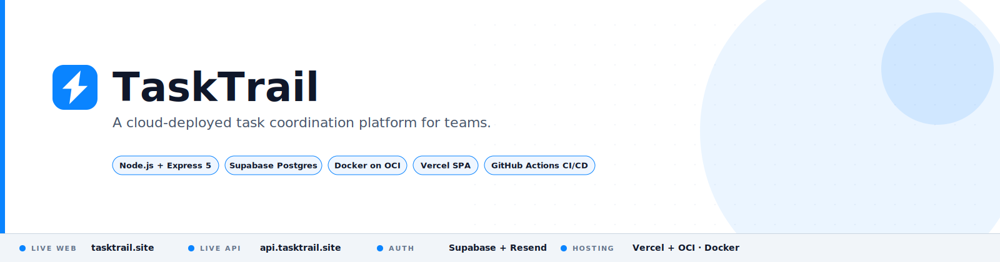
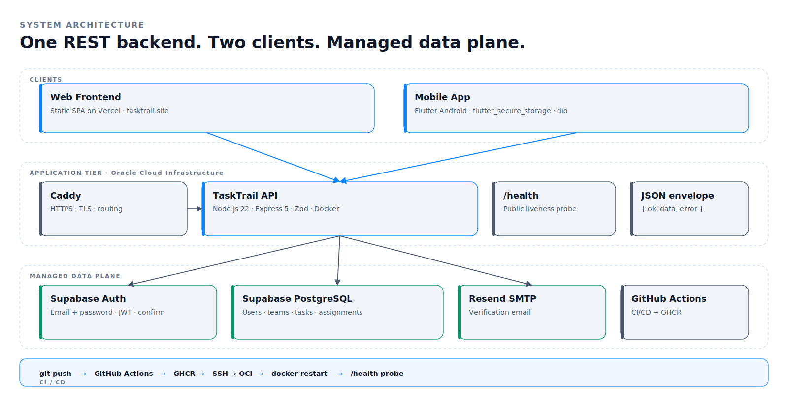
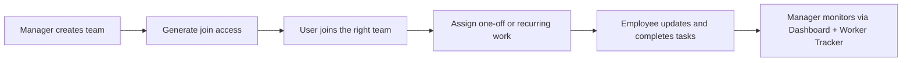

<picture>
  <source media="(prefers-color-scheme: dark)" srcset="docs/assets/hero-dark.svg">
  
</picture>

<p align="center">
  <a href="https://tasktrail.site"><b>Live Web App</b></a>
  &nbsp;·&nbsp;
  <a href="https://api.tasktrail.site/api/v1/health"><b>Live API</b></a>
  &nbsp;·&nbsp;
  <a href="https://github.com/Harry830/tasktrail-mobile"><b>Flutter Mobile Repo</b></a>
  &nbsp;·&nbsp;
  <a href="backend/docs/PROJECT_OVERVIEW.md"><b>Docs</b></a>
</p>

<p align="center">
  <a href="#architecture">Architecture</a> ·
  <a href="#product-flow">Product flow</a> ·
  <a href="#cloud-delivery">Cloud delivery</a> ·
  <a href="#local-development">Local development</a> ·
  <a href="#documentation">Documentation</a>
</p>

---

TaskTrail is a role-aware task coordination system built for small teams. Managers create teams, generate join access, assign one-off or recurring work, and monitor execution. Employees join, pick up assigned work, update progress, and complete tasks. Both experiences run against one shared backend — on the web today, and on mobile from a [separate Flutter repo](https://github.com/Harry830/tasktrail-mobile) using the same API contracts.

## What is live

| Surface | Where | What runs there |
| --- | --- | --- |
| **Web** | [tasktrail.site](https://tasktrail.site) | Static SPA on Vercel — manager and employee surfaces |
| **API** | [api.tasktrail.site](https://api.tasktrail.site/api/v1/health) | Dockerized Node.js + Express on Oracle Cloud Infrastructure |
| **Auth** | Supabase | Email + password, real verification email via Resend-backed SMTP |
| **Data** | Supabase Postgres | Users, teams, memberships, tasks, assignments, recurring rules |
| **CI/CD** | GitHub Actions → GHCR → OCI | Build, push, SSH deploy, and verify `/health` on every main push |

## Architecture

<picture>
  <source media="(prefers-color-scheme: dark)" srcset="docs/assets/architecture-dark.svg">
  
</picture>

The backend is a strict six-layer pipeline — **route → controller → Zod validator → service → repository → Postgres** — so HTTP concerns, business rules, and SQL stay cleanly separated. Cross-cutting middleware handles auth, role guards, and response envelopes. Both the web SPA and the mobile app speak the same `/api/v1` contract.

## Product flow



Every surface in the product supports this one operational loop instead of competing with it.

## Role surfaces

| Role | Surfaces | Purpose |
| --- | --- | --- |
| **Manager** | Dashboard · Worker Tracker · Tasks · Teams · Profile | Assign, track, manage rosters, and keep visibility |
| **Employee** | Tasks · Calendar · Teams · Join Team · Profile | Onboard, execute, report progress |

Goals, hours logging, and productivity metrics from earlier iterations were intentionally removed from the promoted flow to keep the product focused.

## Cloud delivery

| Concern | Choice |
| --- | --- |
| Web hosting | Vercel static deployment |
| API hosting | Dedicated OCI VM |
| Reverse proxy | Caddy → `api.tasktrail.site → 127.0.0.1:4000` |
| Containerization | Dockerized backend |
| CI/CD | GitHub Actions → GHCR → OCI over SSH |
| Verification | Post-deploy probe of `/api/v1/health` |
| Schema changes | Manual Supabase migrations by design |

The deployment workflow lives in [`.github/workflows/backend-deploy.yml`](.github/workflows/backend-deploy.yml) and the remote restart logic in [`backend/scripts/deploy-oci-backend.sh`](backend/scripts/deploy-oci-backend.sh).

## Repository layout

```text
cloud-computing-project/
├── backend/                # Node.js + Express REST API
│   ├── src/                # routes, controllers, services, repositories, middleware
│   ├── sql/                # schema source files
│   ├── scripts/            # seed, smoke, audit, deploy utilities
│   ├── tests/              # unit + integration tests
│   ├── docs/               # architecture, auth, API, deployment docs
│   └── Dockerfile
├── frontend/               # Plain HTML/CSS/JS SPA (no build step)
├── emails/                 # Supabase Auth verification templates
├── docs/assets/            # README visuals
├── .github/workflows/      # CI/CD
└── README.md
```

## Local development

### Backend

```bash
cd backend
cp .env.example .env
npm install
npm run dev
```

Useful commands: `npm test`, `npm run smoke:local`, `npm run seed:demo-group`, `npm run seed:clean-demo`, `npm run audit:local`.

### Frontend

```bash
cd frontend
python3 -m http.server 5500
```

The frontend points at `http://localhost:4000/api/v1` in development and `https://api.tasktrail.site/api/v1` in production.

### Dockerized backend

```bash
docker build -t tasktrail-backend ./backend
docker run --rm -p 4000:4000 --env-file backend/.env tasktrail-backend
```

## Demo access

After `npm run seed:demo-group`:

```
olivia.hart@tasktrail.local      ethan.reyes@tasktrail.local
priya.shah@tasktrail.local       nina.patel@tasktrail.local
marcus.lee@tasktrail.local
```

Password is the value of `DEMO_USER_PASSWORD` in `backend/.env`.

## Design decisions worth calling out

- **One backend, multiple clients.** Web and mobile share the same API contract and role model.
- **Backend-managed auth.** Clients never talk directly to Supabase Auth for protected operations.
- **Durable memberships.** Leaving and rejoining a team preserves history and keeps roster queries clean.
- **Recurring rules generate real tasks.** Generated work behaves like any other task for assignment, updates, and history.
- **Stable response envelope.** Every response uses the same `{ ok, data, error }` shape.
- **No web build step.** The SPA stays lightweight; the backend carries the real product logic.

## Documentation

Backend docs live in [`backend/docs/`](backend/docs):

| Topic | Doc |
| --- | --- |
| Project overview | [PROJECT_OVERVIEW.md](backend/docs/PROJECT_OVERVIEW.md) |
| Architecture | [BACKEND_ARCHITECTURE.md](backend/docs/BACKEND_ARCHITECTURE.md) |
| Database schema | [DATABASE_SCHEMA.md](backend/docs/DATABASE_SCHEMA.md) |
| API reference | [API_REFERENCE.md](backend/docs/API_REFERENCE.md) |
| Auth & RBAC | [AUTH_AND_RBAC.md](backend/docs/AUTH_AND_RBAC.md) |
| Frontend integration | [FRONTEND_INTEGRATION_GUIDE.md](backend/docs/FRONTEND_INTEGRATION_GUIDE.md) |
| Deployment | [DEPLOYMENT_GUIDE.md](backend/docs/DEPLOYMENT_GUIDE.md) |
| Testing strategy | [TESTING_STRATEGY.md](backend/docs/TESTING_STRATEGY.md) |

Contributor guidance lives in [AGENTS.md](AGENTS.md).

## Mobile client

The standalone Flutter client lives at [Harry830/tasktrail-mobile](https://github.com/Harry830/tasktrail-mobile). It consumes the same live backend and role model as the web app.

## Legacy surfaces

Earlier iterations included hours logging, productivity metrics, and goals. Those backend surfaces remain for compatibility but are no longer part of the promoted product spine or active client experience.
